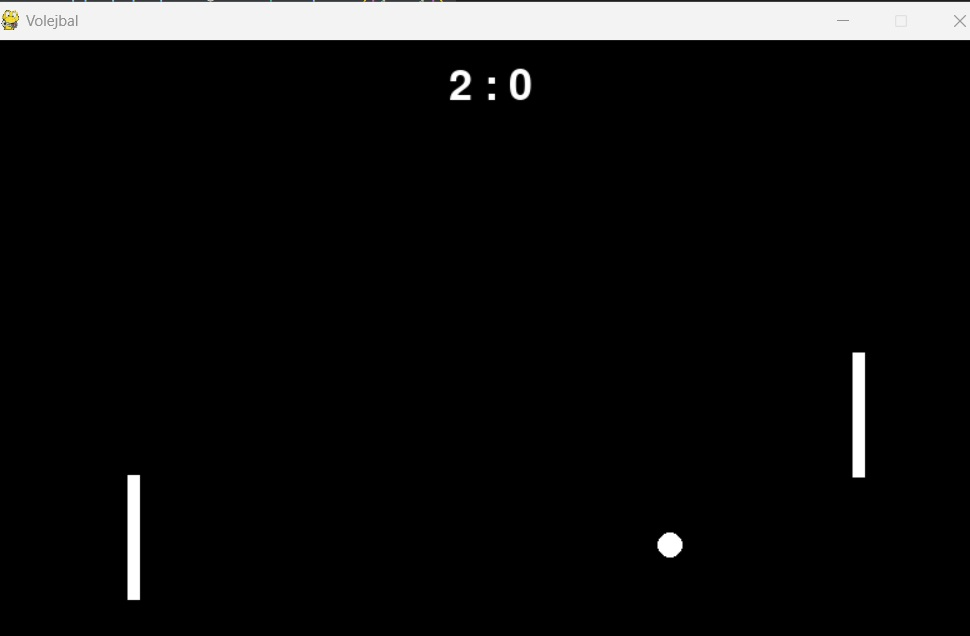

# Volejbalová Hra

Toto je jednoduchá volejbalová hra implementovaná pomocou Pygame. 
Jeden hráč ovláda palku pomocou šípiek nahor a nadol.
Druhý hráč je počítač. Hra končí, keď má jeden hráč náskok dvoch bodov a dosiahol aspoň 15 bodov.



# Konfigurácia
Hra používa konfiguračný súbor config.py na nastavenie rôznych parametrov. 

# Prehľad Kódu
## Funkcie
    def move_player(player, keys): Rieši pohyb pálky hráča na základe stlačených kláves.

    def move_ai(player, ball): Riadi pohyb AI pálky.

    def check_collision(ball, player): Kontroluje kolízie medzi loptou a pálkou.

    def draw_score(window, font, score): Vykresľuje aktuálne skóre na obrazovke.

    def game_over(score): Určuje, či hra skončila na základe skóre.

# Hlavná Herná Slučka
## Hlavná herná slučka rieši udalosti, aktualizuje stav hry a vykresľuje hru:

    1) Riešenie udalostí: Kontroluje ukončovacie udalosti.
    2) Pohyb hráča a AI: Aktualizuje pozície pálok.
    3) Pohyb lopty a detekcia kolízií: Aktualizuje pozíciu lopty a rieši kolízie s pálkami a okrajmi obrazovky.
    4) Aktualizácia skóre: Zvyšuje skóre, keď lopta prejde pálkou.
    5) Vykresľovanie: Vymaže obrazovku, vykreslí pálky, loptu a skóre, a aktualizuje zobrazenie.
    6) Kontrola konca hry: Zobrazí správu "Game Over" po splnení podmienok.

# Podrobnejší popis hry

Pozrite si jednotlivé commity od 0 smerom nahor, sú výstižne pomenované, aby sme vedeli, čo sme v nich robili.

# Ešte podrobnejší popis jednotlivých časti kódu:

## Keď lopta prejde cez ľavý okraj
```python
if lopta.left <= 0:
    score[1] += 1
    lopta.center = (config.ROZLISENIE[0] / 2, config.ROZLISENIE[1] / 2)
    rychlost_lopty_x *= random.choice([1, -1])
    rychlost_lopty_y *= random.choice([1, -1]) 
```


### Detekcia kolízie s ľavým okrajom:
    1) if lopta.left <= 0: - Ak sa ľavý okraj lopty dostane na alebo za ľavý okraj obrazovky (x = 0), podmienka je splnená.

    2) Zvýšenie skóre pre pravého hráča (hráč 2): score[1] += 1 - Skóre pravého hráča sa zvýši o 1.

    3) Resetovanie pozície lopty: lopta.center = (config.ROZLISENIE[0] / 2, config.ROZLISENIE[1] / 2) - Lopta sa umiestni do stredu obrazovky.

    4) Zmena smeru pohybu lopty: rychlost_lopty_x *= random.choice([1, -1]) a rychlost_lopty_y *= random.choice([1, -1]) - Smer pohybu lopty v osi x a y sa náhodne zmení (čiže rýchlosť lopty sa násobí náhodne vybranou hodnotou 1 alebo -1).

*** Podobne pre detekciu s pravým okrajom

## Keď lopta prejde cez ľavý okraj
Táto časť kódu aktualizuje pozíciu lopty v každom hernom cykle na základe jej rýchlosti v osiach x a y.

```python
lopta.x += rychlost_lopty_x
lopta.y += rychlost_lopty_y
```

    lopta.x predstavuje súradnicu x ľavého horného rohu obdĺžnika lopty (lopta je reprezentovaná ako obdĺžnik pomocou pygame.Rect).

    rychlost_lopty_x je aktuálna rýchlosť lopty v osi x.

    lopta.x += rychlost_lopty_x znamená, že sa k súčasnej hodnote súradnice x lopty pripočíta rýchlosť v osi x. Týmto sa lopta pohne horizontálne. Ak je rychlost_lopty_x kladná, lopta sa pohne doprava; ak je záporná, lopta sa pohne doľava.

Podobne pre lopta.y

## Zhrnutie
    lopta.x += rychlost_lopty_x: Posúva loptu horizontálne na základe jej rýchlosti v osi x.
    lopta.y += rychlost_lopty_y: Posúva loptu vertikálne na základe jej rýchlosti v osi y.

    Tento kód je základom pohybu lopty v hre, ktorý umožňuje loptu plynule sa pohybovať po hernej ploche.

## def move_ai(player, ball):

Funkcia move_ai riadi vertikálny pohyb AI hráča tak, aby sledoval loptu. AI hráč sa pohybuje nahor alebo nadol v závislosti od polohy lopty, pričom kontroluje, aby neprekročil hranice obrazovky. Rýchlosť pohybu AI hráča je určená hodnotou config.STEP násobenou 1.5, čo zabezpečuje, že AI hráč reaguje dostatočne rýchlo na pohyb lopty.